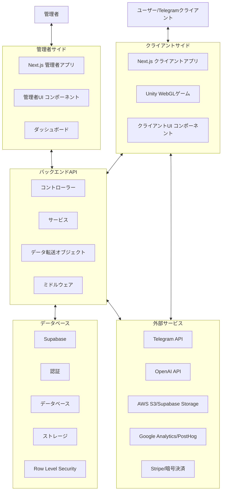
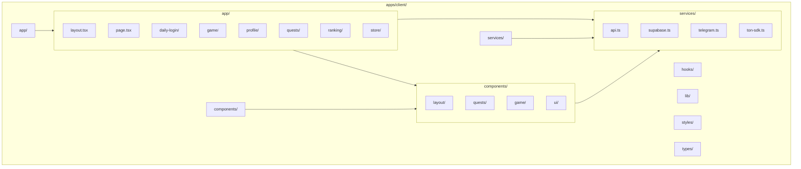
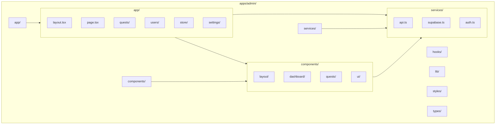
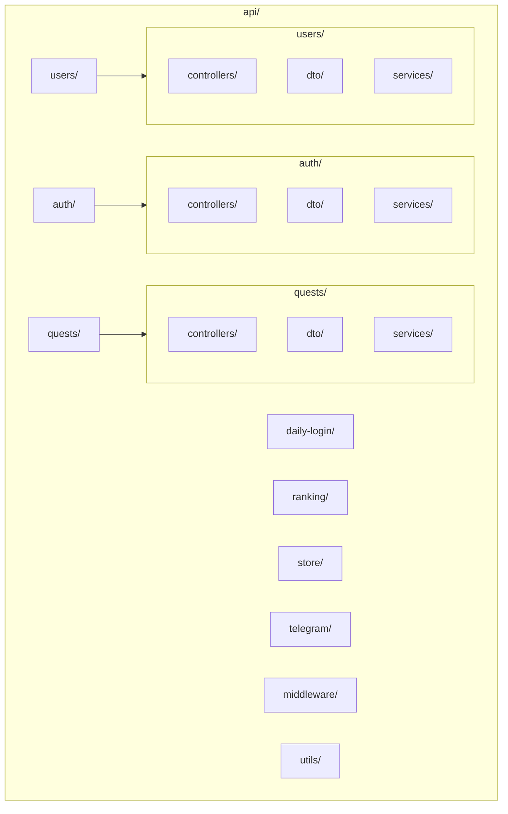
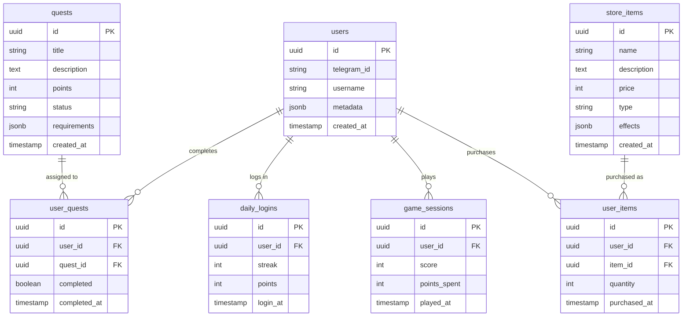
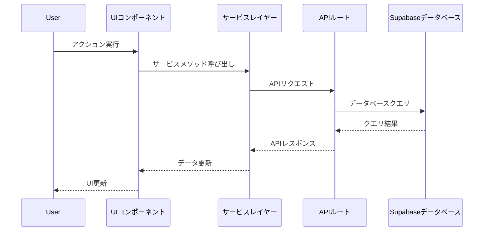
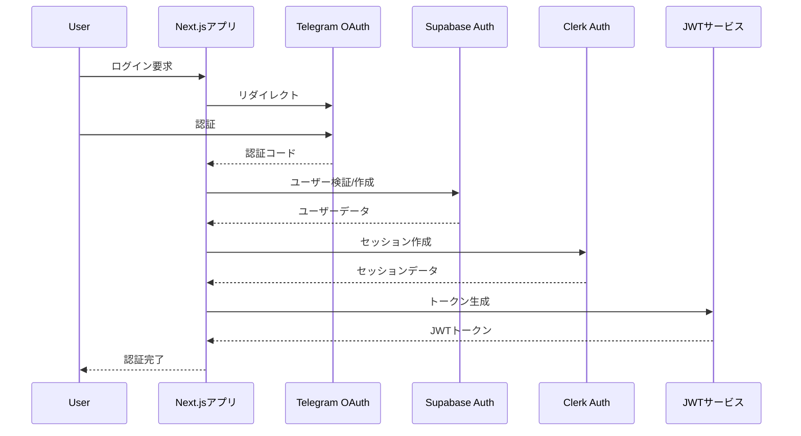
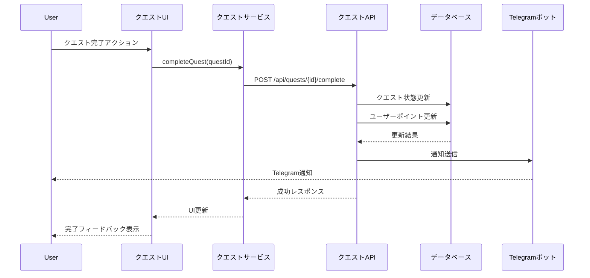
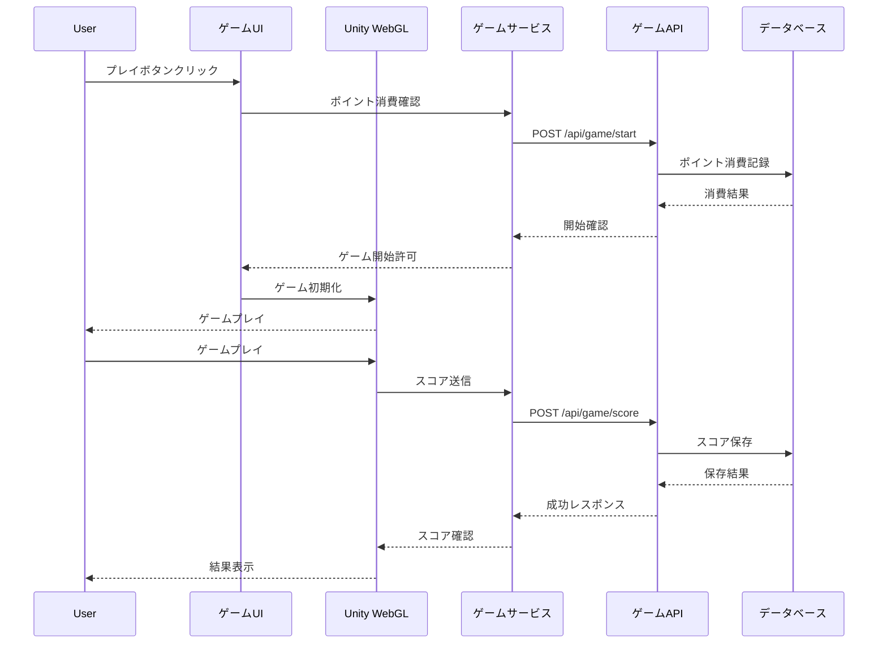

# システムパターン

<!-- 2025/3/18: プロジェクトのリファクタリングに伴い更新 -->

## システムアーキテクチャ

TONゲームは、モダンなウェブアプリケーションアーキテクチャを採用しており、クライアントサイド（Telegram Mini App）、管理者サイド、バックエンドAPI、外部サービス統合の4つの主要レイヤーで構成されています。

### 全体アーキテクチャ



### クライアントサイドアーキテクチャ

クライアントサイドはNext.js 14のApp Routerを使用し、以下のような構造になっています：



### 管理者サイドアーキテクチャ

管理者サイドもNext.js 14のApp Routerを使用し、以下のような構造になっています：



### バックエンドAPIアーキテクチャ

バックエンドAPIはNestJSのベストプラクティスに沿った構造を採用し、以下のような構造になっています：



### データベース構造

Supabaseデータベースは以下のような主要テーブルで構成されています：



## 主要な技術的決定

### 1. Next.js 14 App Routerの採用

**決定**: フロントエンドとバックエンドの両方にNext.js 14のApp Routerを使用する。

**理由**:
- サーバーサイドレンダリング（SSR）とクライアントサイドの機能を組み合わせることで、パフォーマンスとSEOを最適化できる
- APIルートとページルートを同じプロジェクト内で管理できるため、開発効率が向上する
- App Routerは最新のReactパラダイムに準拠しており、将来的な拡張性を確保できる

**トレードオフ**:
- 従来のPages Routerと比較して学習曲線がある
- サーバーコンポーネントとクライアントコンポーネントの区別が必要

### 2. Supabaseの採用

**決定**: データベース、認証、ストレージにSupabaseを使用する。

**理由**:
- PostgreSQLベースの堅牢なデータベースを提供
- Row Level Security（RLS）による強力なセキュリティ機能
- 認証、ストレージ、リアルタイム機能などが統合されており、開発効率が向上する
- APIが使いやすく、フロントエンドとの統合が容易

**トレードオフ**:
- ベンダーロックインの可能性
- カスタマイズの制限

### 3. Unity WebGLの採用

**決定**: リズムゲームの実装にUnity WebGLを使用する。

**理由**:
- 高品質なゲーム体験を提供できる
- クロスプラットフォーム対応が容易
- 豊富なアセットとツールが利用可能
- WebGLによりブラウザ内で直接実行可能

**トレードオフ**:
- 初期ロード時間が長くなる可能性
- モバイルデバイスでのパフォーマンス最適化が必要

### 4. 複数の認証メカニズムの統合

**決定**: Telegram OAuth、Supabase Auth、Clerk Auth、JWTを組み合わせて使用する。

**理由**:
- Telegram OAuthによりTelegramユーザーのシームレスな認証が可能
- Supabase Authによりデータベースとの統合が容易
- Clerk Authにより追加の認証機能を提供
- JWTによりセキュアなセッション管理が可能

**トレードオフ**:
- 複数の認証システムの管理が複雑になる
- 認証フローの整合性を維持する必要がある

## デザインパターン

### 1. コンポーネントベースアーキテクチャ

フロントエンドは再利用可能なコンポーネントを中心に構築されています。各コンポーネントは特定の機能を担当し、プロパティを通じてデータを受け取ります。これにより、コードの再利用性と保守性が向上します。

```typescript
// 例: クエストコンポーネント
interface QuestProps {
  id: string;
  title: string;
  description: string;
  points: number;
  completed: boolean;
  onComplete: (id: string) => void;
}

const Quest: React.FC<QuestProps> = ({ 
  id, title, description, points, completed, onComplete 
}) => {
  // コンポーネントの実装
};
```

### 2. サービスレイヤーパターン

APIとの通信は専用のサービスレイヤーを通じて行われます。これにより、ビジネスロジックとデータアクセスが分離され、コードの保守性と再利用性が向上します。

```typescript
// 例: クエストサービス
export const questService = {
  getQuests: async () => {
    const response = await fetch('/api/quests');
    return response.json();
  },
  
  completeQuest: async (questId: string) => {
    const response = await fetch(`/api/quests/${questId}/complete`, {
      method: 'POST',
    });
    return response.json();
  },
  
  // その他のメソッド
};
```

### 3. リポジトリパターン

データベースアクセスはリポジトリパターンを使用して抽象化されています。これにより、データアクセスロジックが集中管理され、一貫性のあるデータ操作が可能になります。

```typescript
// 例: クエストリポジトリ
export const questRepository = {
  findAll: async () => {
    const { data, error } = await supabase
      .from('quests')
      .select('*')
      .eq('status', 'published');
    
    if (error) throw error;
    return data;
  },
  
  findById: async (id: string) => {
    const { data, error } = await supabase
      .from('quests')
      .select('*')
      .eq('id', id)
      .single();
    
    if (error) throw error;
    return data;
  },
  
  // その他のメソッド
};
```

### 4. ステートマネジメント

ローカルコンポーネント状態とグローバル状態を組み合わせて使用しています。ローカル状態はReactの`useState`フックで管理し、グローバル状態はReactのContext APIを使用して管理します。

```typescript
// 例: ユーザーコンテキスト
export const UserContext = createContext<{
  user: User | null;
  loading: boolean;
  login: (credentials: Credentials) => Promise<void>;
  logout: () => Promise<void>;
}>({
  user: null,
  loading: true,
  login: async () => {},
  logout: async () => {},
});

export const UserProvider: React.FC<{ children: React.ReactNode }> = ({ children }) => {
  // コンテキストプロバイダーの実装
};
```

### 5. ミドルウェアパターン

APIルートでは、認証、エラーハンドリング、ロギングなどの共通機能をミドルウェアとして実装しています。これにより、横断的関心事が分離され、コードの重複が減少します。

```typescript
// 例: 認証ミドルウェア
export const withAuth = (handler: NextApiHandler): NextApiHandler => {
  return async (req, res) => {
    try {
      // トークンの検証
      const token = req.headers.authorization?.split(' ')[1];
      if (!token) {
        return res.status(401).json({ error: 'Unauthorized' });
      }
      
      // ユーザーの検証
      const user = await verifyToken(token);
      if (!user) {
        return res.status(401).json({ error: 'Unauthorized' });
      }
      
      // リクエストにユーザー情報を追加
      req.user = user;
      
      // 元のハンドラーを呼び出す
      return handler(req, res);
    } catch (error) {
      console.error('Auth error:', error);
      return res.status(401).json({ error: 'Unauthorized' });
    }
  };
};
```

## コンポーネント間の関係

### フロントエンドとバックエンドの連携

フロントエンドコンポーネントはサービスレイヤーを通じてバックエンドAPIと通信します。APIレスポンスはフロントエンドの状態に反映され、UIが更新されます。



### 認証フロー

ユーザー認証は複数のシステムを連携させて実現しています。



### クエスト完了フロー

ユーザーがクエストを完了する際のデータフローです。



### ゲームプレイフロー

ユーザーがリズムゲームをプレイする際のデータフローです。



これらのシステムパターンと設計決定により、TONゲームは拡張性が高く、保守性に優れたアーキテクチャを実現しています。
